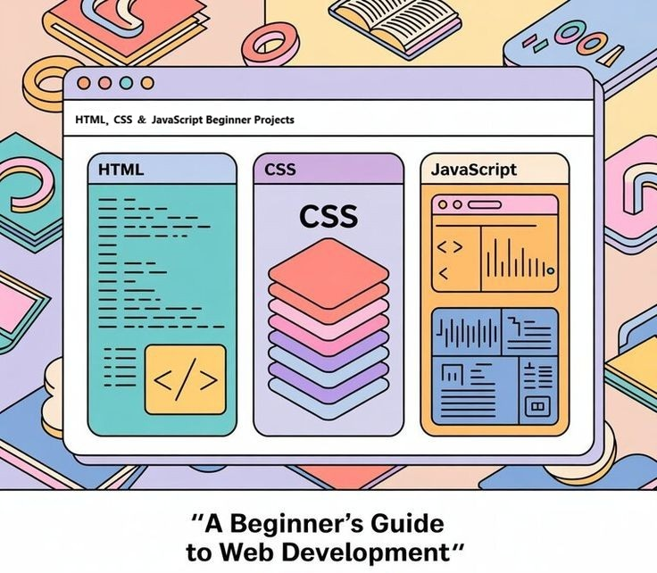

# HTML, CSS & JavaScript Projects

A curated collection of modern, responsive web projects demonstrating front-end development skills. Each project showcases best practices in HTML structure, CSS styling, responsive design, and interactive JavaScript functionality.



---

## 📋 Table of Contents

- [Projects](#projects)
- [Technologies](#technologies)
- [Getting Started](#getting-started)
- [Project Structure](#project-structure)
- [Features](#features)
- [License](#license)

---

## 🚀 Projects

### 1. **JavaScript Foldable Login Form**
A clean, responsive login and registration interface with smooth animations and client-side validation.

- **Location:** `Projects/Javascript Foldable Login form/`
- **Technologies:** HTML5, CSS3, Vanilla JavaScript

📖 [View Full Documentation](Projects/Javascript%20Foldable%20Login%20form/README.md)

---

## 💻 Technologies

Each project utilizes modern web technologies:

- **HTML5** — Semantic markup and form elements
- **CSS3** — Flexbox, Grid, animations, and transitions
- **JavaScript (ES6)** — DOM manipulation, event handling, and form validation
- **Responsive Design** — Mobile-first approach for all devices
- **Cross-browser Compatibility** — Works on Chrome, Firefox, Edge, Safari

---

## 🎯 Getting Started

### Prerequisites

No installation or build tools required. All projects are standalone and work in any modern browser.

### Run Locally

1. **Clone or download this repository**
   ```bash
   git clone <repository-url>
   cd "HTML, CSS & Javascript Projects"
   ```

2. **Navigate to a project**
   ```bash
   cd "Projects/Javascript Foldable Login form"
   ```

3. **Open in browser**
   - Simply double-click `index.html`, or
   - Use a local development server (see below)

### Using a Local Development Server

**Python 3:**
```bash
python -m http.server 8000
# Visit: http://localhost:8000
```

**Node.js (http-server):**
```bash
npm install -g http-server
http-server --port 8000
# Visit: http://localhost:8000
```

**VS Code (Live Server Extension):**
- Install the Live Server extension
- Right-click `index.html` → "Open with Live Server"

---

## 📁 Project Structure

```
HTML, CSS & Javascript Projects/
├── LICENSE
├── README.md (this file)
└── Projects/
    └── Javascript Foldable Login form/
        ├── index.html
        ├── style.css
        ├── script.js
        ├── README.md
        └── images/
```

---

## ✨ Features

- ✅ **Responsive Design** — Optimized for desktop, tablet, and mobile
- ✅ **Modern CSS** — Grid, Flexbox, transitions, and animations
- ✅ **Clean JavaScript** — Well-structured, readable code
- ✅ **Form Validation** — Client-side input validation and feedback
- ✅ **Accessibility** — Semantic HTML and ARIA attributes
- ✅ **Cross-browser Compatible** — Works on all modern browsers
- ✅ **Production Ready** — Ready to extend and customize

---

## 🛠️ Customization

Each project is designed to be easily customizable:

- Modify colors and typography in `style.css`
- Update form fields and content in `index.html`
- Extend functionality in `script.js`
- Replace images in the `images/` directory

Refer to individual project READMEs for detailed customization instructions.

---

## 📚 Learning Resources

These projects are great for:
- Learning HTML5 semantic markup
- Mastering CSS3 flexbox and animations
- Understanding vanilla JavaScript DOM manipulation
- Practicing responsive design techniques
- Building production-ready UI components

---

## 📝 License

This project collection is licensed under the MIT License. See the [LICENSE](LICENSE) file for details.

You are free to use, modify, and distribute these projects for personal and commercial purposes.

---

## 🤝 Contributing

Found a bug or have ideas for improvements? Feel free to:
- Report issues
- Suggest enhancements
- Submit pull requests

---

## 📧 Contact & Support

Created for demonstration and learning purposes.

For questions or feedback, feel free to reach out!

---

**Happy Coding! 🎉**
